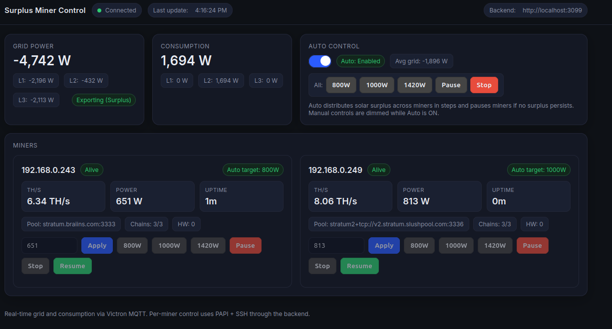
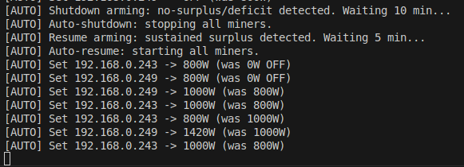

# Proof of Concept Surplus Miner Control

> Adaptive two‑miner power controller that matches ASIC miner load to real‑time solar surplus using discrete power steps and automatic shutdown / resume.



## Key Features
- Real‑time surplus tracking via MQTT (Victron / Venus OS topics)
- Discrete combo power selection for 2 miners: steps per miner = **0 (OFF), 800 W, 1000 W, 1420 W**
- Global evaluation of all pair combinations → picks best fit for current surplus (no step walking / no hysteresis)
- True per‑miner OFF (not just low power) + full BOSminer stop when shutting down
- Automatic shutdown after sustained deficit (configurable minutes)
- Automatic resume after sustained surplus (configurable minutes)
- Fair distribution & combo selection to avoid oscillation
- Socket.io push updates to the web UI (5 s cadence)
- Lightweight responsive dashboard (pure HTML/CSS/JS, no build chain)
- Optional request logging + minimal, meaningful backend logs on state changes

## Project Layout
```
├─ public/              Frontend (single‑page dashboard)
├─ src/
│  ├─ power-control.js  Main server + control loop + MQTT + API
│  └─ server.js         (Legacy / simpler miner API server)
├─ minerConfig/         Miner backup configs (ignored from git via .gitignore)
├─ package.json
└─ .env (user supplied) Runtime configuration
```

## How It Works (Control Loop Summary)
1. Grid power samples (export negative / import positive) arrive via MQTT.
2. A moving window (length 20 samples) averages grid power to smooth noise.
3. Current surplus (negative grid import) is matched against all allowed two‑miner combos:
   - Combos formed from [0, 800, 1200, 1420] × [0, 800, 1200, 1420]
   - Best combo = highest total ≤ surplus (treating surplus as available budget). If none fit, lowest combo above surplus may be chosen (depending on implementation) or 0,0.
4. Direct jump to that combo (no incremental stepping), issuing per‑miner target or OFF.
5. Sustained deficit timer triggers full shutdown (BOSminer stop) when below threshold long enough.
6. Sustained surplus timer triggers resume (BOSminer start) when miners are off and surplus persists.



## Discrete Strategy Rationale
- Eliminates thrash from small watt adjustments.
- Guarantees predictable, fast convergence.
- OFF (0) mapped to a real stop so idle leakage is avoided during deficits.

## Auto Shutdown / Resume
| Behavior | Env Vars | Description |
|----------|----------|-------------|
| Shutdown | `AUTO_SHUTDOWN_MINUTES` | If average surplus not sufficient (grid import / deficit) for this many consecutive minutes → stop all miners. 0 disables. |
| Resume   | `AUTO_RESUME_MINUTES`   | While miners are fully stopped, if sustained surplus persists for this many minutes → start miners and re‑enter combo control. 0 disables. |

## Environment Variables (.env)
Add a `.env` file at project root. Only the most relevant are listed.

| Variable | Purpose | Example |
|----------|---------|---------|
| `MINER_HOSTS` | Comma‑separated list of miner IPs (order matters) | `192.168.0.101,192.168.0.102` |
| `MINER_PORT` | Miner API port (BOSminer / cgminer style) | `4028` |
| `PORT` | Backend HTTP + Socket.io port (power-control.js) | `3099` |
| `FRONTEND_PORT` | Port for `server.js` (if used separately) | `3030` |
| `AUTO_SHUTDOWN_MINUTES` | Minutes of deficit before global stop | `8` |
| `AUTO_RESUME_MINUTES` | Minutes of surplus before restart | `3` |
| `REQUEST_LOG` | Set to `true` to enable per-request logging (filtered) | `true` |
| `PAPI_APPEND_NEWLINE` | Append `\n` to miner JSON command | `false` |
| `PAPI_SEND_NULL` | Append `\0` to miner JSON command | `false` |

(If MQTT host/port need to vary, adjust `power-control.js` or add env wiring.)

## Install & Run
```bash
# 1. Install dependencies
npm install

# 2. Create .env
cat > .env <<'EOF'
MINER_HOSTS=192.168.0.101,192.168.0.102
MINER_PORT=4028
PORT=3099
AUTO_SHUTDOWN_MINUTES=8
AUTO_RESUME_MINUTES=3
EOF

# 3. Start controller
npm start

# 4. Open dashboard
# Navigate to http://localhost:3099 (served from /public)
```

## API Overview (selected)
| Method | Path | Purpose |
|--------|------|---------|
| GET | `/api/miners` | Miner list + last applied targets + state |
| POST | `/api/auto-control` | Enable / disable auto control (`{ enabled: true/false }`) |
| GET | `/api/auto-control` | Returns `{ enabled, lastTargets, minersAreShutDown }` |
| GET | `/api/power` | Current miner(s) power (combined or per host) |
| POST | `/api/power-target` | Manual override per miner (if implemented) |
| GET | `/api/overview` | Raw miner summary/devs/pools passthrough |
| GET | `/api/venus` | Pass‑through for Venus data (grid / consumption) |

Socket.io event: `data_update` every 5 s → `{ power:{...}, consumption:{...}, timestamp }`.

## Logging
- State transitions (enable/disable auto, shutdown, resume) always logged.
- Request logs off by default (set `REQUEST_LOG=true`).
- Avoids noisy per‑interval prints; only meaningful changes surface.

## Extending
Ideas:
- UI manual override per miner with timeout decay back to auto.
- Historical chart (surplus vs applied combo) using lightweight chart lib.
- Add battery SoC awareness (bias decisions lower if battery < X%).
- Adaptive combo preference (track realized vs forecast surplus error).
- Integrate third miner or dynamic number of hosts.
- Configurable MQTT host/port via env.

## Development Notes
- The control loop interval is currently 60 s (see `SURPLUS_CHECK_INTERVAL`). Shorter intervals increase responsiveness but may react to noise—tune with moving average window length.
- Discrete level list defined in `ALLOWED_LEVELS` inside `power-control.js`.
- Combo selection logic in `pickBestCombo` (end of file).

## Safety & Assumptions
- Assumes miners can safely jump between the defined power targets.
- Ensure firmware supports the discrete wattage setpoints used.
- Validate shutdown / start commands in your environment before relying on automation.

## Troubleshooting
| Symptom | Check |
|---------|-------|
| No MQTT data | Broker IP hard-coded? Network? Topics permissions? |
| Targets never change | Auto control enabled? Surplus sign correct (export negative)? |
| Immediate shutdowns | Thresholds too tight; increase shutdown minutes or widen deficit threshold. |
| Resume never triggers | Surplus not sustained long enough or miners already running. |

